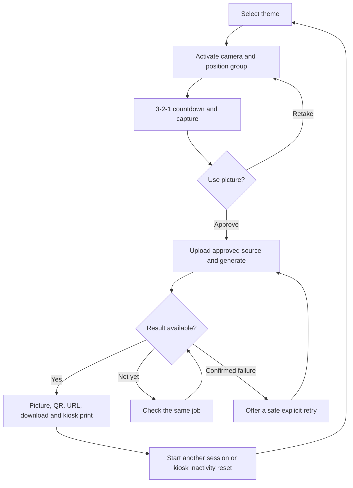

# Bouvet Team Photobooth Implementation Plan

## Handoff Status

Planning decisions recorded on 2026-09-21. This document is ready for a new
coding session. The [product experience playbook](./product-experience-playbook.md)
is the canonical product specification; this roadmap selects the implementation
sequence and does not report implemented application features.

The application is still the Nuxt 4/Vue/Nitro health-check foundation.
**Start with M0: documentation and AI harness alignment only.** Do not implement
application routes, add dependencies, provision resources or make paid provider
calls in that milestone. Later milestones require a separately selected scope.

The [product experience playbook](./product-experience-playbook.md) and
[design playbook](./design-playbook.md) record canonical product and visual
guidance. M0 documentation/harness alignment, M1 product shell/themes and M2
local capture/review are complete. M3 is selected and in progress: private
anonymous sessions, synthetic-image source validation/normalization, local
development storage, and durable source-cleanup state/lease handling are
implemented. A scheduled worker adapter, configured abuse limits, and production
object storage remain.

Suggested next-session request:

> Continue M3 with a scheduled cleanup-worker adapter and configured abuse
> limits. Do not add provider behavior without selecting M4 or use participant
> images before the privacy and retention gates are approved.

## Confirmed Product Decisions

- Exactly four user-facing routes: `/`, `/capture/[theme]`, `/photo/[id]` and
  `/overview`. Countdown, review and generation are local capture-page states.
- Nine selectable themes, with source-controlled configuration and no admin UI.
- A three-second countdown replaces the existing five-second camera baseline.
- Norwegian Bokmal user-facing copy; English engineering documentation.
- Both kiosk and phone visitors can start capture and generation without accounts.
- All unexpired published pictures appear in a public event gallery. Explain
  public publication before capture; opaque URLs do not make listed pictures private.
- Explicit operator-configured kiosk presentation, not user-agent or screen-size
  detection. This setting is not authorization.
- Kiosk printing uses the normal browser print dialog. Silent printing is excluded.
- Automatic inactivity reset is kiosk-only; phone result pages never auto-reset.
- The cumulative completed-picture total for the current event survives photo
  expiry as an aggregate without permanent photo/session links.
- Retention durations remain undecided and must be approved before real-photo
  testing. Provider-side deletion is a separate unresolved verification gate.

Technical approaches below are implementation recommendations, not claims that
provider capabilities, privacy policies or deployment readiness were verified.

## Historical Product-Brief Input

The detailed requirements in this historical planning input are canonical in the
[product experience playbook](./product-experience-playbook.md). Maintain future
product changes in that playbook; this retained planning record must not create
a competing specification.

### Purpose And Principles

Create a quick, intuitive conference activity that transforms an ordinary team
photo into a playful AI-generated group portrait. Visitors choose a fictional
universe; the app does not assess personality or decide which team they belong to.
The experience should encourage collaboration and conversations with Bouvet.

Prioritize a shared group experience, recognizable people, coherent visual style,
few interactions, touch-friendly controls, clear privacy information and reliable
repeated use. Each screen has one clear purpose and limited actions. Visitors
should understand the journey without stand personnel. Results should be easy
to view, print and retrieve on a phone. Present Bouvet as friendly, playful,
professional and technologically capable.

### Routes And Journey

| Route              | Required behavior                                                                                                                                                                  |
| ------------------ | ---------------------------------------------------------------------------------------------------------------------------------------------------------------------------------- |
| `/`                | Nine visual theme buttons with title, image and short description; each opens capture directly; subtle overview link.                                                              |
| `/capture/[theme]` | Camera activation/ready, countdown, capture, review/retake, approved upload, generation and recoverable errors in one route.                                                       |
| `/photo/[id]`      | Prominent generated image, QR code, readable/copyable public URL, download, kiosk print, take-another action and expired/unavailable states.                                       |
| `/overview`        | Six recent completed pictures per page, responsive two-by-three or three-by-two grid, total on the right where space permits, older/newer navigation and a restrained home action. |

The retry arrow applies only to a confirmed retryable failure with a retained
approved source. A client timeout or uncertain provider acceptance must not
trigger another paid request.

Camera requirements:

- Explain purpose and privacy before requesting permission, after an explicit
  user gesture. Display positioning guidance and one clear capture action.
- Support fixed kiosk and mobile cameras.
- Reject invalid themes before camera or session work. Explain missing support,
  permission denial, camera-in-use and other recoverable failures.
- Display `3`, `2`, `1`; capture once at or after 3000 ms using a monotonic
  deadline. Prevent repeated input and cancel safely on interruption.
- Show the exact captured framing at a useful size. Retake returns to camera;
  Use picture approves processing. Never upload or generate before approval.
- Replace review controls with a clear generation state, selected universe and
  short playful status. Poll application status, prevent duplicates, preserve
  the approved source for permitted retries and redirect when output is ready.

Result and gallery requirements:

- QR, readable URL and copy action use the same clean public photo-page URL.
  Scanning works without the kiosk's private session cookie.
- Print cancellation or an unavailable printer must not block other actions.
  Browser code cannot reliably confirm a physical print succeeded.
- Return friendly loading, error, missing and expired states. Never show sources
  on public result or gallery pages.
- Refresh only the first gallery page automatically as results complete; preserve
  position when browsing older pictures.
- Show Older pictures only when older items exist and Newer pictures only when
  newer items exist. Use Norwegian labels in the interface. No page numbers,
  total pages or traditional pagination control.
- Use stable keyset cursors, ordered by completion time plus a unique tie-breaker.
  `/overview?before=<cursor>` is suitable; a matching `after` cursor can support
  newer navigation. Carry enough ordering data to survive boundary-row deletion;
  do not depend on a retained picture row or expose internal IDs.

### Themes And Visual Direction

Preserve these nine concepts, with stable slugs independent of translated names:

1. Post-apocalyptic wasteland
2. Tree-top fantasy village
3. Block world
4. Space cowboys
5. Life simulation
6. Mech pilots
7. 1980s kids-on-bikes adventure
8. Red carpet
9. Samurai

Theme names, descriptions, images and dedicated prompt templates are configured
in source. Keep public descriptors separate from server-only prompts and provider
settings. Use rights-cleared artwork; do not introduce franchise branding by
assumption. No administration site is needed.

Follow the [design playbook](./design-playbook.md) for Bouvet's visual direction,
screen compositions, tokens, responsive behavior, accessibility and visual
verification. It translates the supplied screenshots without treating placeholder
copy, example URLs or missing controls as changes to product requirements.

### Generation And Backend

Each theme prompt should preserve the number of people, recognizable facial and
personal characteristics, group arrangement and approximate poses. Apply its
universe consistently to clothing, setting, lighting and atmosphere. Aim to avoid
missing/duplicate people, extra limbs and duplicated accessories. Output must
be suitable for display and the agreed print format. These are quality objectives
requiring representative evaluation, not guaranteed model behavior or a reason
to add biometric recognition.

The backend creates short-lived sessions, accepts only approved source images,
records theme choice, starts asynchronous generation, tracks pending/completed/
failed states, ingests generated output into application storage, serves public
results, lists recent pictures, maintains the count and performs retention cleanup.

Candidate API operations, to refine per implementation slice:

| Operation                          | Purpose                                                   |
| ---------------------------------- | --------------------------------------------------------- |
| `POST /api/sessions`               | Create a private short-lived session with selected theme. |
| `POST /api/sessions/[id]/capture`  | Upload and validate the approved source.                  |
| `POST /api/sessions/[id]/generate` | Start one logical generation operation.                   |
| `GET /api/sessions/[id]/status`    | Return sanitized progress and result status.              |
| `POST /api/sessions/[id]/retry`    | Perform only a classified, authorized retry.              |
| `GET /api/photos/[publicId]`       | Return available public picture metadata.                 |
| `GET /api/photos/recent`           | Return up to six completed pictures and cursors.          |
| `GET /api/photos/count`            | Return the cumulative current-event total.                |

A public theme projection, application image/download endpoint and bounded
session-close operation may be added as needed. These do not add UI routes.

Keep internal session ID, separate opaque public picture ID, selected theme,
creation/expiry timestamps, source/output references, generation state and
failure/retry information. Additional job leases, idempotency keys and cleanup
state are implementation details, not public DTOs. Do not freeze unused DTOs in M0.

### Privacy, Sessions And Kiosk

- Explain capture purpose, processing provider, public-gallery publication,
  retention and removal contact before capture, within the four routes. Agree
  how all participants acknowledge this before real-photo testing.
- Do not use photos for unrelated training, analytics or marketing without
  separate consent. Verify processor data-use terms; keep operational logs free
  of image bytes, credentials and unnecessary personal information.
- Recommend a short-lived private anonymous capability in a Secure, HttpOnly,
  SameSite cookie, with hashed server-side state. Authorize session upload,
  generate, retry and status separately from public reads. Protect mutations
  against cross-origin/CSRF abuse. A public photo ID grants no private access.
- Public mobile generation requires layered session/network limits, bounded
  queues/concurrency and authoritative event-wide spend reservations before paid
  submission. Set numeric limits before public paid use; no billing UI is needed.
- Generate distinct random public IDs with at least 128 bits of entropy; do not
  reuse internal database, session or provider IDs. Serve only published,
  unexpired output from application storage, never provider URLs or sources.
- Use a validated canonical HTTPS public origin for QR/copy links and a local QR
  library. Do not trust arbitrary Host headers or leak kiosk flags/capabilities.
- Reset kiosk state on explicit restart or inactivity: stop tracks, revoke object
  URLs, clear source blobs/private caches/capabilities, cancel timers and polling,
  and return to `/`. History/back and stale async callbacks must not restore a
  previous group's source or attach an old job to a new session.
- Fence abandoned pending sessions against late publication while reconciling and
  cleaning up provider work. A reset cannot promise cancellation of an accepted
  paid request. Completed public pictures retain their configured lifetime.
- Define inactivity and generation-wait grace periods explicitly. Polling does
  not count as visitor activity. Phone tab hiding cancels capture; a submitted
  job may resume status through the still-valid private capability after return.
- Configure kiosk fullscreen at the browser/OS level. Keep the app usable through
  camera, network, generation and print failures without extra browser controls.
- Count each durably stored, published result exactly once, not each attempt.
  Expiration does not decrement the event aggregate. No permanent identifier-linked
  analytics history is needed to maintain the total.
- Delete application sources after durable output success; bound failed/abandoned
  source retention. Configure separate session, result, tombstone and minimal
  operational cleanup-ledger windows before real-photo use.
- Expired metadata, image/download and gallery reads must stop immediately even
  if physical deletion is queued. Bound cache lifetimes, delete stored bytes and
  associated data automatically, retain only required temporary cleanup state,
  and never repopulate expired results from Leonardo.
- Local deletion, `public: false` and signed URLs do not prove provider erasure.
  Provider deletion remains unverified. If guaranteed remote erasure is required,
  unsupported deletion blocks real-photo use/launch. A privacy owner must approve
  any residual-retention policy; an agent cannot waive it.
- Copies visitors download or print cannot be remotely erased by the application.

### Exclusions

No administration website, visitor accounts, personality assessment, group-role
approval model, complex gallery filters, numbered pagination, permanent storage,
arbitrary public prompts/model controls, silent-print integration or platform
migration. Mock generation is a development/test tool, not the completed MVP.

## Existing Technical Baselines

Read and retain the relevant domain guidance:

- [Photobooth design](./design-playbook.md): screenshot-derived layouts, styling,
  copy, accessibility and visual verification.
- [Camera and initial images](./camera-and-initial-image-playbook.md): camera
  lifecycle, monotonic deadlines, capture/crop, compression and upload validation.
- [Leonardo integration](./leonardo-integration-playbook.md): server-only provider
  adapter, model settings, uncertain submission, completion, ingestion and cleanup.
- [Data and jobs](./prisma-data-and-jobs-playbook.md): PostgreSQL/Prisma, durable
  jobs, object storage and Netlify-first deployment.

Recheck historical provider/package facts when implementing their milestones.
Do not change source-verification dates without actually checking those sources.
Keep quantity one and approved server-side model settings; no automatic costly
quality/model escalation. A database unique constraint does not guarantee
exactly-once external paid execution.

Known alignment work for M0: replace five-second camera text/examples/tests with
three seconds; distinguish public result/gallery reads from private anonymous
session authorization; separate public IDs from internal row IDs; clarify
bounded source retention, abandoned work and cumulative count semantics. Do not
silently override a conflicting technical guide with this roadmap.

## Milestones

Application milestones M2-M7 are pending. Update status and verification
evidence as the remaining work completes.

### M0: Documentation And Harness (Complete)

**Completed scope:** documentation and narrowly necessary harness validator/tests only.

1. Create `docs/product-experience-playbook.md` from the product brief above and
   confirmed decisions. Include observable acceptance criteria and identifiers
   for requirement-to-milestone traceability. Move detailed requirements out of
   this roadmap once the canonical guide exists.
2. Align the three technical guides at the specific conflicts listed above;
   retain safety constraints and provider-erasure caveats. Avoid copying their
   chapters into the product guide or instructions.
3. Update root Copilot guidance, relevant frontend/backend/contracts/testing
   scoped instructions, implementation/verification skills, README and the AI
   development reading map. Link the product guide and roadmap directly; preserve
   narrow `applyTo` scopes and distinguish implemented, active and future work.
4. Add the product guide to `canonicalPlaybooks` in the existing harness validator.
   Reuse existing fixtures to test missing required guides and independent root/
   task-specific routing. Keep dynamic playbook discovery and local-link checks.
   The roadmap remains ordinary linked Markdown, not another domain playbook.
5. Run focused checks, then the documentation/harness merge gates below. Manually
   check anchors, requirement coverage and discovery. Do not add new harness
   frameworks, hooks, agents, dependencies, application DTO stubs or runtime code.

**Acceptance:** all draft requirements and nine themes preserved; decisions and
privacy gates explicit; no conflicting five-second or private-only result guidance;
correct root/task routing; README still truthfully describes the health scaffold;
checks and skipped checks reported. M1 remains unstarted.

### M1: Product Shell And Themes (Complete 2026-09-21)

**Depends on:** completed M0 and selection of M1 for implementation.

Add the Nuxt page shell and four page files, nine configured theme descriptors,
public metadata projection, rights-cleared assets, Norwegian copy and Bouvet
styling. Later-flow placeholders must not imply a finished journey. Preserve
the dependency-free health API and its regression coverage.

Introduce the central Norwegian message catalog using the
[language-file rules](../.github/instructions/frontend.instructions.md#language-files):
Nuxt/Vue i18n, nested feature/state keys, locale `nb` only, no language picker,
browser-language detection or locale-prefixed routes. Resolve theme names and
descriptions from the catalog using stable theme IDs; do not duplicate translated
display text in the theme configuration. Extend instruction scopes to cover the
locale directory when it is created. Add catalog validation and real-message tests
with this slice; do not install localization dependencies during M0.

**Acceptance:** all cards and navigation, invalid-theme handling, no camera on
landing, no private prompt/provider settings in public metadata, accessible
keyboard/touch layout and desktop/mobile fit. Test the real theme API and UI,
including Norwegian messages, accessible labels and matching SSR/client locale
without missing keys. Keep the agreed public URLs unchanged.

**Verification:** `pnpm check` and `pnpm test:e2e` passed on macOS under Node
24.15.0. The production browser suite exercises all nine public descriptors,
Norwegian theme selection, valid/invalid capture routes, desktop/mobile overflow
and the retained health API contract. The theme artwork is source-controlled,
abstract original SVG artwork; approved Bouvet logo artwork has not been
provided, so the existing textual brand treatment remains.

### M2: Local Capture And Review (Complete 2026-09-21)

**Depends on:** M1. May proceed alongside M3 after shared contracts are agreed.

Implement owned camera/state composables, activation and permission recovery,
mobile camera preferences/switching, three-second countdown, single-frame
capture, preview/retake/approve and bounded compression. Keep sources in memory
before approval. Use synthetic/fake media until the real-photo privacy gate is
approved.

**Acceptance:** no capture before 3000 ms, exactly one capture despite timer drift
and repeated clicks, safe cancellation/hidden-tab/track-end/unmount behavior,
crop/mirror parity, track/object-URL cleanup and no upload before approval.
Use fake-clock/media component tests and a browser capture journey.

**Verification:** `pnpm check` and `pnpm test:e2e` passed on macOS under Node
24.15.0. The local-only capture route requires an explicit camera action, uses a
deadline-based three-second countdown, supports JPEG/PNG/WebP fallback and keeps
bounded normalized blobs in memory. It does not create a session, upload a
source, call a provider or persist a picture. Component tests cover fake media,
countdown timing/cancellation and stream cleanup; the production browser suite
uses Chromium fake media for desktop and mobile capture/review/approval.

### M3: Sessions, Source Storage And Jobs

**Depends on:** M1 contracts. May proceed alongside M2.

Revalidate dependencies/platform limits, then implement anonymous session
authorization, CSRF/origin controls, approved-source validation/normalization,
object storage and the minimal PostgreSQL/Prisma session/image/job schema.
Add durable leases, cleanup, upload limits and abuse/budget controls from the
start. No actor/group/admin model or speculative infrastructure is required.

**Acceptance:** reject cross-session access, forged requests and corrupt/spoofed/
oversized input; converge duplicate uploads; never publicly serve source bytes;
recover jobs/cleanup after restart. Test real PostgreSQL and real Nitro endpoints
with isolated storage/synthetic images. Approve retention before real-photo use.

### M4: Generation And Recovery

**Depends on:** M2, M3 and verified provider schema/completion/cost contracts.

Implement the Leonardo adapter, per-theme prompts, asynchronous submission,
authenticated idempotent completion, confirmed reconciliation, durable output
ingestion, sanitized status/retry and result redirect. Reserve spend atomically;
publish/count only after output is durable and readable.

Use deterministic provider adapters behind real application APIs for development
and CI. No paid CI calls or browser happy-path API mocks. Unknown acceptance
holds/reconciles; ingestion failures retry the same output, not generation.

**Acceptance:** complete source-to-result workflow; duplicate approval/webhooks
and lease recovery cannot produce duplicate logical publication/counting;
timeouts do not blindly resubmit; classified retries preserve approved sources;
expired sources cannot retry. Real provider smoke/quality tests require explicit
budget approval and privacy approval before participant images are used.

### M5: Results And Kiosk Presentation

**Depends on:** M3 public-result/expiry contract; integration completes after M4.
Can build against agreed fixtures alongside M4.

Implement public metadata/image/download serving, result layout, locally generated
QR, readable/copy URL, phone download, kiosk print layout and centralized reset.
Use the canonical public origin, separate random public IDs and explicit kiosk
configuration. Do not auto-reset phone result pages.

**Acceptance:** scanned links work without private cookies; expired metadata,
image and download reads deny access; no source/provider leak; clipboard/print
failures recover; kiosk reset/history cannot reveal a previous source. Verify
desktop/mobile screenshots, keyboard behavior and real API boundaries.

### M6: Public Event Overview

**Depends on:** M4 publication/counting and M5 public-result contract.

Implement recent/count APIs, six-item grid, stable before/after cursors, restrained
older/newer actions and polling only on the first page. Keep an event aggregate
independent of expiring picture records; no new real-time platform or admin UI.

**Acceptance:** empty, one, six and seven-plus results; equal completion times;
concurrent arrivals/deletions; expired cursor boundaries; correct nav visibility;
older-page stability; exactly-once aggregate increments; unchanged total after
expiry. Cover database/API and browser behavior.

### M7: Event Readiness

**Depends on:** integrated M2-M6 and explicit deployment authorization.

Finish operational validation rather than deferring basic privacy/cleanup to this
stage. Configure approved retention, inactivity/grace periods, public limits,
event budget/identifier, canonical HTTPS origin and print format. Verify processor
terms, artwork rights and group likeness/print quality against approved settings.

Deploy the existing Netlify-first adapters, workers/scheduler and migrations with
isolated non-production storage. Add an operator runbook to this plan; split it
into another document only when actual operational content warrants that.

**Acceptance:** observe scheduled expiry, lease recovery and object/cache/metadata
cleanup in the target environment; exercise late callbacks, offline/reconnect,
reset at every stage, repeated groups and budget saturation. Test physical kiosk
camera/printing and Android/iOS camera/download behavior, including phone return
after suspension. Record approvals and evidence. Node browser tests alone do not
prove deployed jobs, hardware behavior or privacy compliance.

## Owning Files And Reuse

M0 updates these existing surfaces rather than creating a second harness:

- [Root guidance](../.github/copilot-instructions.md) and
  [scoped instructions](../.github/instructions).
- [Implementation skill](../.github/skills/implement-vertical-slice/SKILL.md) and
  [verification skill](../.github/skills/verify-change/SKILL.md).
- [README](../README.md), [AI development](./ai-development.md) and the three
  technical playbooks linked above.
- [Harness validator](../scripts/check-harness.mjs), especially
  `canonicalPlaybooks`/`validateHarness`, and
  [existing fixture tests](../scripts/check-harness.test.mjs).

For later runtime work, reuse the typed `defineEventHandler` producer pattern,
relative `useFetch` loading/error/retry states, `@lucide/vue` icons and existing
`mountSuspended`/`vi.hoisted`/`mockNuxtImport` tests. Relevant owners:

- [Application shell](../apps/web/app/app.vue); future pages/components/composables
  stay under `apps/web/app`.
- Server-only registry, validation, services and adapters stay under
  `apps/web/server`; public artwork goes under `apps/web/public/themes`.
- [Contract exports](../packages/contracts/src/index.ts) remain type-only. Add
  minimal producer/consumer DTOs with their implementing slice.
- Future Prisma schema/migrations belong to `apps/web/prisma`; platform worker
  adapters follow the data playbook. Do not edit generated `.nuxt`/`.output`.
- [Nuxt tests](../apps/web/test/nuxt) and [browser tests](../apps/web/test/e2e)
  keep their current separation. Retain the isolated production-server behavior
  in [Playwright configuration](../apps/web/playwright.config.ts).

## Verification And Gates

Use the pinned pnpm version and Node 24 LTS, at least 24.15.0. Bootstrap with
`pnpm install --frozen-lockfile` and `pnpm prepare` when needed.

For M0, run a focused check immediately after the relevant edit:

- `node --test scripts/check-harness.test.mjs` for validator/fixture changes.
- `pnpm check:harness` for document references and routing.
- `pnpm format:check` and `pnpm lint:markdown` for Markdown quality.
- `pnpm check` before handoff. Manually inspect heading anchors, requirement
  consistency and representative instruction-discovery prompts.

M0 does not change app/build behavior, so `pnpm test:e2e` may be explicitly skipped
for that reason. For every application milestone, run focused tests immediately,
then `pnpm check` and `pnpm test:e2e` with a fresh owned production server. Add
real PostgreSQL checks for jobs, cursor ordering and aggregate behavior.

CI uses synthetic images and deterministic provider adapters. Paid provider tests,
physical hardware tests and deployed worker checks are separate observed gates.
Report local macOS results separately from observed Windows/Linux CI results.

| Gate                                                                                                | Must be resolved before |
| --------------------------------------------------------------------------------------------------- | ----------------------- |
| Numeric retention windows, participant disclosure/agreement and processor data-use/retention policy | Real-photo testing      |
| Supported reconciliation and any mandatory provider erasure guarantee                               | Real-photo provider use |
| Server-enforced anonymous abuse limits, concurrency and numeric spend cap                           | Public paid generation  |
| Artwork rights, public origin/event ID, inactivity settings and print format                        | Event launch            |
| Actual scheduled cleanup, deployment smoke, camera/printing and mobile-browser checks               | Event launch            |

Do not invent approved values or report an external gate as passed because a
document, mock test or deployment configuration exists.
