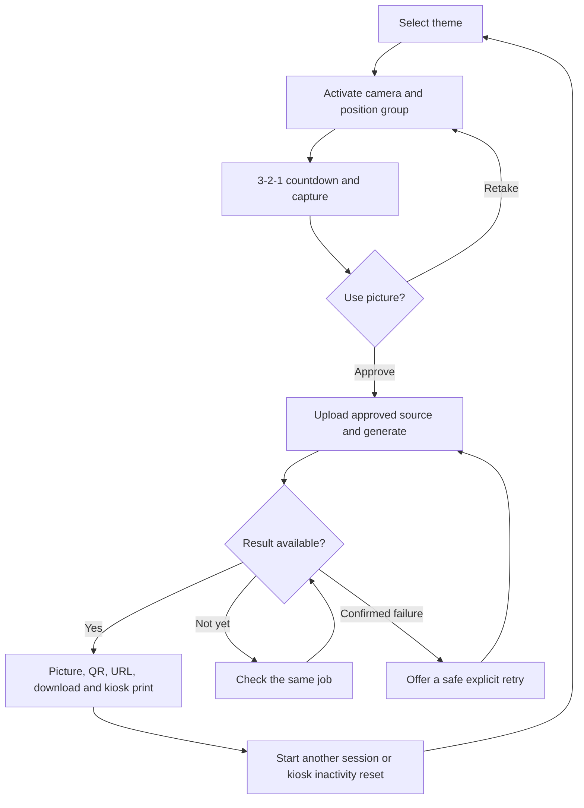

# Product Experience Playbook

## Purpose And Scope

Bouvet Team Photobooth is a quick conference activity for groups visiting the
Bouvet stand. Visitors choose a fictional universe, capture and approve a group
photo, receive a recognizable themed portrait, and can share, download, print,
or browse completed public pictures. It is a playful shared experience, not a
personality assessment or a way to determine team membership.

This is the canonical product specification. The
[implementation plan](./implementation-plan.md) selects milestones and records
readiness gates; it does not authorize work from future milestones. Follow the
applicable technical playbooks for implementation constraints.

## Product Principles

- Make the group activity intuitive without stand personnel.
- Prioritize recognizable people, coherent visual themes, few interactions, and
  touch-friendly controls.
- Explain public sharing and privacy before capture. Keep original sources
  private and retain data only for approved, bounded periods.
- Present Bouvet as friendly, playful, professional, and technologically capable.
- Keep each screen focused on one purpose with limited actions.

## Requirements And Traceability

Identifiers make product requirements traceable to the selected milestone. They
describe expected behavior, not implemented functionality.

| ID    | Requirement                                                                                                                         | Milestone |
| ----- | ----------------------------------------------------------------------------------------------------------------------------------- | --------- |
| PX-01 | The product exposes exactly `/`, `/capture/[theme]`, `/photo/[id]`, and `/overview`; capture substates remain on the capture route. | M1        |
| PX-02 | Visitors choose one of nine configured fictional themes before capture.                                                             | M1        |
| PX-03 | Camera capture uses an explicit permission gesture, a three-second countdown, review/retake, and approval before upload.            | M2        |
| PX-04 | Private anonymous sessions protect upload, generation, retry, and status operations.                                                | M3        |
| PX-05 | Generation is asynchronous, duplicate-safe, and does not blindly resubmit uncertain paid requests.                                  | M4        |
| PX-06 | Public results provide a generated image, QR code, readable URL, download, and kiosk print without exposing sources.                | M5        |
| PX-07 | The public overview shows completed pictures with stable cursor navigation and an event aggregate that survives expiry.             | M6        |
| PX-08 | Retention, public-origin, abuse, spend, hardware, and provider-erasure gates are resolved before their applicable real-world use.   | M7        |

## Routes And Journey

| Route              | Required behavior                                                                                                                                                             |
| ------------------ | ----------------------------------------------------------------------------------------------------------------------------------------------------------------------------- |
| `/`                | Show nine visual theme buttons with title, image, and short description; each opens capture directly, alongside a subtle overview link.                                       |
| `/capture/[theme]` | Handle camera activation/ready, countdown, capture, review/retake, approved upload, generation, and recoverable errors.                                                       |
| `/photo/[id]`      | Show the generated image, QR code, readable and copyable public URL, download, kiosk print, another-photo action, and expired/unavailable states.                             |
| `/overview`        | Show six recent completed pictures per page, a responsive two-by-three or three-by-two grid, the total on wide screens, older/newer navigation, and a restrained home action. |

Only a confirmed retryable failure with a retained approved source may retry.
A client timeout or uncertain provider acceptance must not create another paid
request.

## Themes

Theme slugs remain stable independently of translated display names. Configure
public names, descriptions, rights-cleared artwork, and dedicated server-only
prompt templates in source; do not add an administration UI or assume franchise
branding rights.

1. Post-apocalyptic wasteland
2. Tree-top fantasy village
3. Block world
4. Space cowboys
5. Life simulation
6. Mech pilots
7. 1980s kids-on-bikes adventure
8. Red carpet
9. Samurai

## Capture And Generation

- Explain purpose, processing provider, public publication, retention, and the
  removal contact before requesting camera access, after a user gesture.
- Support fixed kiosk and mobile cameras, with the supported image-picker
  fallback defined in the camera playbook.
- Reject invalid theme slugs before camera or session work. Explain unavailable
  cameras, permission denial, camera-in-use, and other recoverable failures.
- Display `3`, `2`, `1`, capture once at or after 3000 ms using a monotonic
  deadline, prevent repeated input, and cancel safely on interruption.
- Show the exact captured framing at a useful size. Retake returns to camera;
  **Use picture** approves processing. Never upload or generate before approval.
- Replace review controls with selected-theme generation status. Poll application
  status, prevent duplicates, preserve an approved source only for permitted
  retries, and redirect once output is ready.
- Theme prompts preserve group count, recognizable facial and personal
  characteristics, arrangement, and approximate poses while applying the chosen
  universe consistently. This is a quality objective, not biometric recognition
  or a model-behavior guarantee.

## Public Results And Overview

- QR, readable URL, and copy action use one canonical public photo URL that
  works without a kiosk private-session cookie.
- Kiosk printing opens the normal browser print dialog. Cancellation or an
  unavailable printer must not block other actions; browser code cannot prove a
  physical print succeeded.
- Return friendly loading, error, missing, and expired states. Public result and
  gallery pages never expose original sources, provider URLs, or private session
  capabilities.
- Refresh only the first overview page after results complete. Preserve position
  on older pages.
- Show Norwegian **Eldre bilder** only when older results exist and **Nyere
  bilder** only when newer results exist. Do not add page numbers, total pages,
  or traditional pagination controls.
- Use completion time plus a unique tie-breaker for stable keyset cursors.
  `/overview?before=<cursor>` is suitable; `after` may support newer navigation.
  Cursors must survive boundary-row deletion without exposing internal IDs.
- Count each durably stored, published result once. The current-event aggregate
  does not decrement when an individual picture expires and needs no permanent
  picture/session link.

## Privacy, Sessions, And Kiosk

- Agree how all participants acknowledge public publication before real-photo
  testing. Do not use photos for unrelated training, analytics, or marketing
  without separate consent.
- Use a short-lived private anonymous capability in a Secure, HttpOnly,
  SameSite cookie, with hashed server-side state. Authorize private session
  operations separately from public result/gallery reads and protect mutations
  against cross-origin/CSRF abuse.
- Generate distinct random public picture IDs with at least 128 bits of entropy.
  Never reuse internal row, session, or provider IDs; public IDs grant no private
  access.
- Serve only published, unexpired generated output from application storage.
  Validate a canonical HTTPS public origin for QR/copy links and do not trust
  arbitrary Host headers.
- Kiosk mode is explicit operator configuration, not user-agent or screen-size
  detection and not authorization. Reset it on explicit restart or inactivity:
  stop tracks, revoke object URLs, clear sources/private caches/capabilities,
  cancel timers/polling, and return to `/`.
- Phone result pages never auto-reset. History/back and stale asynchronous work
  must not restore a former group source or attach an old job to a new session.
- Submitted work can outlive a reset and must be fenced against late publication.
  Reset cannot guarantee cancellation of an accepted paid request.

## Retention And Readiness Gates

- Delete application-owned sources after durable output ingestion succeeds;
  bound failed and abandoned source retention. Expired public metadata, image,
  download, and gallery reads stop immediately even when physical deletion is
  queued.
- Bound cache lifetimes, delete stored bytes and associated data automatically,
  retain only necessary temporary cleanup state, and never repopulate expired
  results from Leonardo.
- Local deletion, `public: false`, and signed URLs do not prove provider erasure.
  Unsupported provider deletion blocks real-photo use if guaranteed remote
  erasure is required. A privacy owner must approve residual retention.
- Copies visitors download or print cannot be remotely erased.

| Gate                                                                                                 | Must be resolved before |
| ---------------------------------------------------------------------------------------------------- | ----------------------- |
| Numeric retention windows, participant disclosure/agreement, and processor data-use/retention policy | Real-photo testing      |
| Supported reconciliation and any mandatory provider-erasure guarantee                                | Real-photo provider use |
| Server-enforced anonymous abuse limits, concurrency, and numeric spend cap                           | Public paid generation  |
| Artwork rights, public origin/event ID, inactivity settings, and print format                        | Event launch            |
| Scheduled cleanup, deployment smoke, camera/printing, and mobile-browser checks                      | Event launch            |

## Exclusions

Do not add an administration site, visitor accounts, personality assessment,
group-role approval, complex gallery filters, numbered pagination, permanent
storage, arbitrary public prompts/model controls, silent-print integration, or
a platform migration. Mock generation is a development/test tool, not a
completed MVP.
